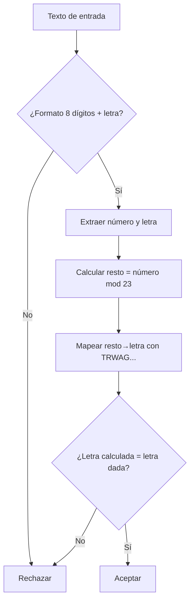
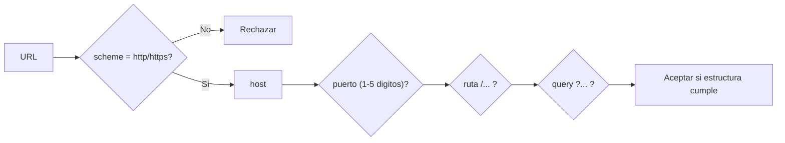

# Introducción a REGEX y grep en Unix: fundamentos, POSIX vs PCRE y validaciones prácticas

Las expresiones regulares (REGEX) son un lenguaje para describir patrones en texto y localizar (o filtrar) coincidencias. Su potencia depende del “sabor” (flavour) de regex que use la herramienta: en el mundo Unix, `grep` trabaja principalmente con **POSIX BRE/ERE** (según uses `grep` o `grep -E`), mientras que algunas variantes (normalmente **GNU grep**) ofrecen **PCRE** mediante `grep -P` (no estándar, y no siempre disponible).

La diferencia más importante entre POSIX y PCRE no es solo sintáctica (“qué hay que escapar”), sino también semántica: **POSIX tiende a resolver ambigüedades con la regla “leftmost-longest”** (la coincidencia más a la izquierda y, entre ellas, la más larga), mientras que **PCRE evalúa alternativas de izquierda a derecha y se queda con la primera que permite un match completo**, lo que hace que el orden de los `|` importe más en PCRE.

En la práctica con `grep`, lo habitual es:
- Usar `grep -E` (ERE) para la mayoría de búsquedas y validaciones “razonables”.
- Reservar `grep -P` (PCRE) cuando necesitas **lookarounds** (`(?=...)`, `(?<=...)`), clases abreviadas (`\d`, `\w`), cuantificadores perezosos (`*?`) o construcciones avanzadas (grupos con nombre, etc.). citeturn18view2turn21view0turn25view1
- Asumir que `grep` es **fundamentalmente lineal por líneas**: por defecto no puede “cruzar” saltos de línea; en GNU grep existe `-z` (líneas separadas por NUL) como mecanismo especial, y en casos complejos conviene pasar a `awk`, `sed` o `perl`.

En cuanto a “validar” con regex: funciona bien para **estructuras** (p. ej., IPv4, CP) y como **filtro previo** (p. ej., DNI o email), pero hay validaciones que requieren reglas externas (ej. letra del DNI) o gramáticas demasiado ricas (ej. email completo según Internet Message Format).

## Fundamentos de las expresiones regulares

Una regex es una secuencia de símbolos donde “la mayoría de caracteres se interpretan literalmente” y un conjunto de **metacaracteres** adquiere significado especial para describir variaciones, repeticiones y alternativas.

### Metacaracteres esenciales

En sabores tipo PCRE (y la mayoría de motores modernos), fuera de corchetes suelen ser metacaracteres `.^$|()[]*+?{}` y la barra invertida `\` como escape.

En POSIX (BRE/ERE) el conjunto “operador vs literal” depende del sabor: por ejemplo, `+` y `?` son operadores en ERE, mientras que en BRE suelen requerir escape (y aun así puede variar por implementación). En **GNU grep**, BRE y ERE son esencialmente “lo mismo con distinto escapado”.

### Cuantificadores

Los cuantificadores especifican repeticiones:
- `*` → 0 o más
- `+` → 1 o más
- `?` → 0 o 1
- `{n}`, `{n,}`, `{n,m}` → repetición acotada (si el motor lo soporta en ese modo)

En PCRE existen además cuantificadores “perezosos” (`*?`, `+?`, `??`, `{n,m}?`) y posesivos, que no existen en POSIX clásico.

### Clases, conjuntos y atajos

- **Clase de caracteres**: `[abc]`, `[0-9]`, `[A-Za-z]` (con cuidado en locales).
- **Negación**: `[^0-9]` (cualquier carácter excepto dígito).
- **Clases POSIX**: `[[:digit:]]`, `[[:alpha:]]`, `[[:space:]]`, etc. (portables en POSIX y muy útiles en `grep`).
- **Atajos tipo PCRE**: `\d`, `\w`, `\s`, `\b` (no portables a POSIX ERE/BRE salvo extensiones).

### Anclas

Las anclas no consumen caracteres; delimitan posiciones:
- `^` inicio de línea
- `$` fin de línea  
En herramientas tipo `grep`, `^` y `$` operan sobre líneas (porque `grep` es line-based).

### Grupos y retroreferencias

Los grupos capturan parte del match y se referencian después:
- En PCRE: `( ... )` captura; `(?: ... )` no captura; retroreferencias `\1`, `\2`, etc.
- En POSIX, la situación depende de BRE/ERE y de la implementación; en GNU grep hay soporte de “subexpresiones y back-references” según el manual.

### Escapes y la “doble capa” de escapado

En terminal hay dos niveles:
1) **El shell** interpreta comillas, `$`, `\`, etc.  
2) **El motor regex** interpreta metacaracteres.

Por eso suele recomendarse envolver patrones en **comillas simples** `'...'` para que el shell no “toque” el patrón, y usar `-e` cuando el patrón podría empezar por `-`.

image_group{"layout":"carousel","aspect_ratio":"16:9","query":["cheatsheet expresiones regulares español","grep regular expressions quick reference","POSIX character classes bracket expressions"],"num_per_query":1}

## POSIX y PCRE: comparación y diferencias relevantes

### POSIX: BRE y ERE en el ecosistema Unix

POSIX define dos sintaxis históricas:
- **BRE** (Basic Regular Expressions): suele ser el modo por defecto en `grep` (`-G` explícito en GNU).
- **ERE** (Extended Regular Expressions): se activa con `grep -E`.

Además de la sintaxis, POSIX define reglas de resolución de ambigüedades: **leftmost-longest** (la coincidencia más a la izquierda y más larga). Esta regla aparece en la especificación base de expresiones regulares.

### PCRE: “Perl-compatible” y backtracking

PCRE2 está diseñado para emular de cerca la sintaxis y semántica de Perl: más construcciones (lookarounds, cuantificadores perezosos, grupos con nombre, etc.) y una semántica típica de motores de backtracking.

Un punto práctico clave: en PCRE, la alternancia `|` se evalúa **probando alternativas de izquierda a derecha** y “la primera que funciona” se usa. Esto hace que el orden de alternativas sea parte del significado (más que en POSIX).

### Tabla comparativa de sintaxis y capacidades

| Aspecto | POSIX BRE (`grep` / `grep -G`) | POSIX ERE (`grep -E`) | PCRE (`grep -P` / `pcregrep`) |
|---|---|---|---|
| Alternancia | normalmente `\|` (según implementación) | `|` | `|` |
| Grupos | `\(...\)` | `(...)` | `(...)`, `(?:...)`, `(?<name>...)` |
| Cuantificadores | `*` seguro; `\{m,n\}` según implementación/portabilidad | `* + ? {m,n}` | + lo anterior y perezosos `*?` etc. |
| Retroreferencias | posibles (`\1`) dependiendo de motor/sabor | no es el caso típico/portable | sí (`\1`, `\k<name>`, etc.) |
| Lookaround | no | no | sí (`(?=...)`, `(?<=...)`, etc.) |
| Clases POSIX | sí (`[[:digit:]]`) | sí | sí (además `\d`, `\w` si Unicode/flags) |
| Regla de desambiguación | “leftmost-longest” | “leftmost-longest” | alternativas probadas L→R; backtracking típico |
| Portabilidad en Unix | muy alta | muy alta | media (depende de herramienta y build) |

Base normativa y documentación para esta comparación: POSIX (reglas de matching), manual de GNU grep (BRE/ERE, limitaciones y compatibilidad), y documentación de PCRE2 sobre metacaracteres y alternancia.

## grep en Unix: grep, grep -E/egrep, grep -P y opciones útiles

### Motores y modos de patrón

En sistemas tipo Linux con GNU grep, las opciones de sintaxis principales son: `-G` (BRE, por defecto), `-E` (ERE), `-F` (cadenas literales), `-P` (PCRE).

`grep -P` puede advertir de “features no implementadas” y su combinación con `-z` se considera experimental (según la página de manual).

Sobre `egrep`/`fgrep`: fueron equivalentes históricos de `grep -E` y `grep -F`, pero están obsoletos en POSIX desde hace décadas y GNU grep los considera deprecados (con avisos de obsolescencia). En scripts nuevos conviene usar `grep -E` / `grep -F`.

### Opciones especialmente útiles en práctica

`grep` tiene un conjunto de opciones “de trabajo diario”, destacando:

- **Control del patrón**: `-e PAT` (varios patrones), `-f FILE` (patrones desde fichero).
- **Control de matching**: `-i` (case-insensitive), `-v` (invertir), `-w` (palabra completa), `-x` (línea completa).
- **Salida**: `-n` (número de línea), `-H/-h` (mostrar/ocultar nombre de fichero), `-o` (solo el match), `--color=auto`. 
- **Contexto**: `-A/-B/-C` (líneas antes/después).
- **Recursión**: `-r` / `-R` (buscar en directorios).
- **Scripts/automatización**: `-q` (salida silenciosa, usar código de salida), `-m N` (parar tras N coincidencias).

Nota importante: los patrones suelen ir entre comillas (por ejemplo, `'...'`) para evitar que el shell los altere.

### Limitaciones estructurales de grep

- **grep es line-based**: por defecto no hay forma directa de hacer match de un `\n` real dentro de texto, y el manual lo expone explícitamente (“no hay forma de hacer match de newlines” en modo estándar).
- En GNU grep, `-z` cambia el delimitador de “línea” a NUL, lo que permite que el patrón abarque antiguos saltos de línea, pero la salida y el enfoque cambian significativamente; si esto no basta, el propio manual recomienda transformar la entrada o usar `awk`, `sed`, `perl`, etc.

## Patrones de validación y búsqueda con grep

### Tabla resumen de patrones y compatibilidad

| Caso | Objetivo | Regex recomendada | Compatibilidad | Nota clave |
|---|---|---|---|---|
| DNI (con letra) | Formato + letra de control | filtro ERE + validación con `awk/perl` | ERE (filtro), algoritmo fuera de regex | la letra depende de módulo 23 |
| Email (práctico) | Emails comunes en logs/forms | ERE “pragmática” | POSIX ERE | evita cubrir el RFC completo |
| Email (RFC 5322 simplificado) | estructura `local@dominio` más estricta | PCRE | `grep -P` o `pcregrep` | `addr-spec` tiene variantes complejas |
| IPv4 | 4 octetos 0–255 | ERE (o PCRE equivalente) | POSIX ERE | regex puede validar rangos 0–255 |
| CP España | 5 dígitos (opcional 01–52) | ERE | POSIX ERE | norma: 5 dígitos |
| URL http/https | esquema + host + puerto + ruta + query | ERE o PCRE (más legible) | ERE (parcial) / PCRE (mejor) | RFC 3986 define sintaxis genérica |

Fuentes normativas para estructura de DNI/NIE, códigos postales y sintaxis de email/URI: organismos públicos y RFCs.

### Validación de DNI español con letra

#### Qué se puede y no se puede hacer con regex

Una regex puede verificar **formato** (8 dígitos + letra) pero **no puede calcular** de forma nativa el módulo 23 para comprobar la letra (salvo enumeraciones impracticables). Por eso el enfoque recomendado en Unix es:

1) `grep` filtra candidatos por formato.  
2) `awk` o `perl` calcula la letra y valida.  

El algoritmo oficial (explicado por la entity["organization","Dirección General de Ordenación del Juego","gobierno de espana"]) es: dividir el número entre 23, tomar el resto (0–22) y mapear a la letra según la tabla; incluye el ejemplo `12345678 → resto 14 → Z`.

#### Regex (filtro de formato) en POSIX ERE

**Regex (ERE, línea completa):**
```
^[0-9]{8}[A-Z]$
```

**Versión un poco más estricta (solo letras posibles del control):**
```
^[0-9]{8}[TRWAGMYFPDXBNJZSQVHLCKE]$
```

**Explicación paso a paso**
- `^` inicio de línea.
- `[0-9]{8}` exactamente 8 dígitos (incluye ceros iniciales, que existen en NIF/DNI).
- `[A-Z]` una letra mayúscula (o el conjunto explícito de letras de control).
- `$` fin de línea.

**Ejemplos válidos (formato + letra coherente con tabla)**
- `12345678Z` (ejemplo oficial del cálculo).
- `00000000T` (0 mod 23 = 0 → T según tabla).

**Ejemplos no válidos**
- `12345678A` (formato OK, pero letra no coincide con el ejemplo; debería ser Z).
- `1234567Z` (7 dígitos).  
- `12345678z` (minúscula si no usas `-i`).  
- `1234 5678Z` (espacio).  

#### Búsqueda en ficheros con grep/egrep/grep -P

**Buscar líneas que “parecen DNI” (formato)**
```bash
grep -nE '^[0-9]{8}[A-Z]$' datos.txt
```

**Con nombre histórico (no recomendado en scripts nuevos)**
```bash
egrep -n '^[0-9]{8}[A-Z]$' datos.txt
```
`egrep` es obsolescente/deprecado; `grep -E` es el equivalente moderno.

**Validación real (letra correcta) con Perl (alternativa recomendada)**  
Esto ya no es `grep`, pero es el modo Unix “correcto” de completar la validación:
```bash
perl -ne 'chomp; if(/^(\d{8})([A-Za-z])$/){$n=$1; $l=uc($2); $k="TRWAGMYFPDXBNJZSQVHLCKE"; print "$_\n" if substr($k,$n%23,1) eq $l}' datos.txt
```
La tabla de letras y el módulo 23 están descritos en la referencia oficial.

#### Casos de prueba

Archivo de prueba:
```bash
cat > pruebas_dni.txt <<'EOF'
12345678Z
12345678A
00000000T
00000000R
1234567Z
12345678z
EOF
```

- Filtro por formato (deberían salir 5 líneas: todas salvo `1234567Z`):
```bash
grep -nE '^[0-9]{8}[A-Z]$' pruebas_dni.txt
```

- Validación completa (deberían salir solo `12345678Z` y `00000000T`):
```bash
perl -ne 'chomp; if(/^(\d{8})([A-Za-z])$/){$n=$1; $l=uc($2); $k="TRWAGMYFPDXBNJZSQVHLCKE"; print "$_\n" if substr($k,$n%23,1) eq $l}' pruebas_dni.txt
```

**Diagrama de flujo (validación DNI)**



La parte “mapear resto→letra” y el ejemplo oficial están publicados por un organismo público. citeturn23view0

### Validación de email

#### Marco: RFC vs práctica

El Internet Message Format define que `addr-spec = local-part "@" domain` y reconoce variantes (dot-atom, quoted-string, domain-literal, etc.), lo que hace que una validación completa por regex sea larga y delicada.

Por ello se suelen usar dos patrones:
- **Versión práctica (ERE)**: cubre “emails normales” en logs y formularios.
- **Versión RFC 5322 simplificada (PCRE)**: más estricta, aún sin pretender cubrir el 100% de casos del RFC.

#### Email práctico (POSIX ERE)

**Regex (ERE, línea completa):**
```
^[A-Za-z0-9._%+-]+@[A-Za-z0-9-]+(\.[A-Za-z0-9-]+)+$
```

**Explicación paso a paso**
- `^` … `$`: validación de línea completa.
- `[A-Za-z0-9._%+-]+`: local-part “pragmático” (caracteres comunes).  
- `@`: separador. citeturn28search2  
- `[A-Za-z0-9-]+(\.[A-Za-z0-9-]+)+`: dominio con al menos un punto.  

**Válidos**
- `ana@example.com`
- `john.smith+tag@sub.example.es`

**No válidos (según este patrón práctico)**
- `ana@localhost` (sin punto; a veces válido en entornos internos, pero no aquí)
- `ana@@example.com`
- `ana..lopez@example.com` (pasaría en este patrón; limitación típica de la versión práctica)
- `"ana"@example.com` (quoted-string: válido en RFC en ciertos casos, no contemplado aquí)

**grep/egrep**
```bash
grep -nE '^[A-Za-z0-9._%+-]+@[A-Za-z0-9-]+(\.[A-Za-z0-9-]+)+$' emails.txt
```

#### Email “RFC 5322 simplificado” (PCRE recomendado)

Este patrón apunta a ser más estricto en:
- longitud máxima orientativa (local-part <= 64; email total <= 254, práctica común),
- dot-atom sin puntos consecutivos,
- dominio con etiquetas razonables (sin guiones al inicio/fin de etiqueta).  
La estructura básica `local-part@domain` y opciones del RFC están documentadas.

**Regex (PCRE, línea completa):**
```
^(?=.{1,254}$)(?=.{1,64}@)[A-Za-z0-9!#$%&'*+/=?^_`{|}~-]+(?:\.[A-Za-z0-9!#$%&'*+/=?^_`{|}~-]+)*@(?:[A-Za-z0-9](?:[A-Za-z0-9-]{0,61}[A-Za-z0-9])?\.)+[A-Za-z]{2,63}$
```

**Desglose**
- `(?=.{1,254}$)` límite total aproximado.  
- `(?=.{1,64}@)` límite aproximado del local-part.  
- `...+(?:\....)*` impide `..` y `.` final/inicial en el local-part.  
- Dominio: secuencia de etiquetas `label.` con etiqueta `label` que:
  - empieza y acaba en alfanumérico,
  - permite guiones en medio,
  - limita tamaño a 63.

**Compatibilidad**
- Requiere PCRE: `grep -P` si tu `grep` lo soporta, o `pcregrep`.

**Comandos**
```bash
grep -nP '^(?=.{1,254}$)(?=.{1,64}@)[A-Za-z0-9!#$%&'\''*+/=?^_`{|}~-]+(?:\.[A-Za-z0-9!#$%&'\''*+/=?^_`{|}~-]+)*@(?:[A-Za-z0-9](?:[A-Za-z0-9-]{0,61}[A-Za-z0-9])?\.)+[A-Za-z]{2,63}$' emails.txt
```

Si no tienes `grep -P`, alternativa:
```bash
pcregrep -n '^(?=.{1,254}$)(?=.{1,64}@)...$' emails.txt
```
`pcregrep` es un “grep” que usa PCRE para patrones compatibles con Perl.

#### Casos de prueba (email)

```bash
cat > pruebas_email.txt <<'EOF'
ana@example.com
john.smith+tag@sub.example.es
ana@localhost
ana@@example.com
"ana"@example.com
EOF
```

- Patrón práctico ERE (debería devolver las 2 primeras líneas):
```bash
grep -nE '^[A-Za-z0-9._%+-]+@[A-Za-z0-9-]+(\.[A-Za-z0-9-]+)+$' pruebas_email.txt
```

- Patrón PCRE (debería devolver también las 2 primeras; seguirá sin aceptar `"ana"@...` porque no cubrimos quoted-string):
```bash
grep -nP '^(?=.{1,254}$)(?=.{1,64}@)...$' pruebas_email.txt
```

### Validación de dirección IPv4

Una dirección IPv4 en notación decimal con puntos suele representarse como cuatro números (octetos) `a.b.c.d`, donde cada octeto está en `0..255`.

#### Regex (POSIX ERE) para validar 0–255 por octeto

**Regex (ERE, línea completa):**
```
^((25[0-5]|2[0-4][0-9]|1[0-9]{2}|[1-9]?[0-9])\.){3}(25[0-5]|2[0-4][0-9]|1[0-9]{2}|[1-9]?[0-9])$
```

**Explicación (por componentes)**
- `25[0-5]` → 250–255  
- `2[0-4][0-9]` → 200–249  
- `1[0-9]{2}` → 100–199  
- `[1-9]?[0-9]` → 0–99 (evita `099` como 3 dígitos)  
- `(...\.){3}` → tres octetos con punto, y el último octeto sin punto.

**Válidos**
- `0.0.0.0`
- `192.168.1.1`
- `255.255.255.255`

**No válidos**
- `256.0.0.1` (octeto fuera de rango)
- `192.168.1` (faltan octetos)
- `192.168.001.1` (este patrón lo rechaza por “001”)  

#### grep/egrep/grep -P

**Validación de líneas enteras**
```bash
grep -nE '^((25[0-5]|2[0-4][0-9]|1[0-9]{2}|[1-9]?[0-9])\.){3}(25[0-5]|2[0-4][0-9]|1[0-9]{2}|[1-9]?[0-9])$' ips.txt
```

**Búsqueda dentro de texto (extraer coincidencias) — GNU grep**
```bash
grep -oE '((25[0-5]|2[0-4][0-9]|1[0-9]{2}|[1-9]?[0-9])\.){3}(25[0-5]|2[0-4][0-9]|1[0-9]{2}|[1-9]?[0-9])' logs.txt
```
`-o` imprime solo la parte coincidente.

#### Casos de prueba (IPv4)

```bash
cat > pruebas_ipv4.txt <<'EOF'
192.168.1.1
255.255.255.255
0.0.0.0
256.0.0.1
192.168.1
192.168.001.1
EOF

grep -nE '^((25[0-5]|2[0-4][0-9]|1[0-9]{2}|[1-9]?[0-9])\.){3}(25[0-5]|2[0-4][0-9]|1[0-9]{2}|[1-9]?[0-9])$' pruebas_ipv4.txt
```

### Validación de código postal español

Normativa: el código postal para la clasificación de correspondencia se establece como **cinco dígitos** (Real Decreto), y la normativa de desarrollo explica la significación: dos primeros dígitos (provincia), tercer dígito (ciudades importantes/itinerarios), cuarto y quinto (áreas de reparto/rutas).

Además, una corrección normativa indica explícitamente casos como Ceuta y Melilla (51 y 52).

#### Regex (POSIX ERE)

**Versión simple (solo 5 dígitos)**
```
^[0-9]{5}$
```

**Versión más estricta (01–52 + 3 dígitos)**
```
^(0[1-9]|[1-4][0-9]|5[0-2])[0-9]{3}$
```

**Explicación rápida**
- `^[0-9]{5}$` valida el requisito “cinco dígitos”. 
- En la estricta:
  - `(0[1-9]|[1-4][0-9]|5[0-2])` limita provincia 01–52 (incluye 51/52). 
  - `[0-9]{3}` resto del CP.

**Válidos**
- `28013`
- `51001` (Ceuta, rango permitido) citeturn22view0  

**No válidos**
- `ABCDE`
- `1234` (4 dígitos)
- `99000` (provincia fuera de 01–52 en versión estricta)

#### grep/egrep/grep -P

```bash
grep -nE '^[0-9]{5}$' direcciones.txt
grep -nE '^(0[1-9]|[1-4][0-9]|5[0-2])[0-9]{3}$' direcciones.txt
```

#### Casos de prueba (CP)

```bash
cat > pruebas_cp.txt <<'EOF'
28013
51001
99000
1234
ABCDE
EOF

grep -nE '^[0-9]{5}$' pruebas_cp.txt
grep -nE '^(0[1-9]|[1-4][0-9]|5[0-2])[0-9]{3}$' pruebas_cp.txt
```

### Validación de URL web (http/https)

#### Marco RFC y alcance práctico

La sintaxis genérica de un URI define el esquema y componentes como `authority`, `path`, `query`, `fragment`. En ABNF: `URI = scheme ":" hier-part [ "?" query ] [ "#" fragment ]` y `scheme = ALPHA *( ALPHA / DIGIT / "+" / "-" / "." )`.

Aquí pediste específicamente **URL web http/https** con:
- `http` o `https`
- dominio
- puerto opcional
- ruta opcional
- query opcional

No intentaremos cubrir:
- credenciales `user:pass@` (permitidas por RFC, a menudo desaconsejadas),
- IPv6 en host (`[::1]`),
- IDN/Unicode (debería ir en punycode si se exige ASCII),
- normalización avanzada.

#### Regex práctica (POSIX ERE)

**Regex (ERE, línea completa):**
```
^https?://([A-Za-z0-9]([A-Za-z0-9-]{0,61}[A-Za-z0-9])?\.)+[A-Za-z]{2,63}(:[0-9]{1,5})?(/[^?#]*)?(\?[^#]*)?$
```

**Desglose**
- `^https?://`  
  - `http` + `s?` opcional → `http` o `https`.
- `([A-Za-z0-9]([A-Za-z0-9-]{0,61}[A-Za-z0-9])?\.)+`  
  - etiquetas DNS separadas por puntos, con guion solo en medio (aprox. regla clásica de hostname).
- `[A-Za-z]{2,63}` TLD “simple” (limitamos a letras para evitar casos raros).  
- `(:[0-9]{1,5})?` puerto opcional (1–5 dígitos; no valida <=65535). 
- `(/[^?#]*)?` ruta opcional (sin `?` ni `#`). 
- `(\?[^#]*)?` query opcional (sin `#`).

**Válidos**
- `https://example.com`
- `http://sub.example.es:8080/ruta/algo?x=1&y=2`

**No válidos**
- `ftp://example.com` (esquema fuera de alcance)
- `https://-ejemplo.com` (etiqueta empieza por `-`)
- `https://example.com:99999` (pasa por regex pero puerto semánticamente inválido; limitación)

#### Regex PCRE alternativa (más legible para extracción)

Si dispones de PCRE, puedes separar mejor por grupos (aunque `grep` no imprime grupos sin ayuda adicional). En PCRE2 la semántica de alternancia y metacaracteres está documentada.

**Regex (PCRE, línea completa):**
```
^https?://(?:(?:[A-Za-z0-9](?:[A-Za-z0-9-]{0,61}[A-Za-z0-9])?)\.)+[A-Za-z]{2,63}(?::\d{1,5})?(?:/[^?#]*)?(?:\?[^#]*)?$
```

#### grep/egrep/grep -P

**Con ERE (portable)**
```bash
grep -nE '^https?://([A-Za-z0-9]([A-Za-z0-9-]{0,61}[A-Za-z0-9])?\.)+[A-Za-z]{2,63}(:[0-9]{1,5})?(/[^?#]*)?(\?[^#]*)?$' urls.txt
```

**Con PCRE (si disponible)**
```bash
grep -nP '^https?://(?:(?:[A-Za-z0-9](?:[A-Za-z0-9-]{0,61}[A-Za-z0-9])?)\.)+[A-Za-z]{2,63}(?::\d{1,5})?(?:/[^?#]*)?(?:\?[^#]*)?$' urls.txt
```
Ten presente que `grep -P` puede avisar de funciones no implementadas en algunos builds.

#### Casos de prueba (URL)

```bash
cat > pruebas_url.txt <<'EOF'
https://example.com
http://sub.example.es:8080/ruta/algo?x=1&y=2
ftp://example.com
https://-ejemplo.com
https://example.com:99999
EOF

grep -nE '^https?://([A-Za-z0-9]([A-Za-z0-9-]{0,61}[A-Za-z0-9])?\.)+[A-Za-z]{2,63}(:[0-9]{1,5})?(/[^?#]*)?(\?[^#]*)?$' pruebas_url.txt
```

**Diagrama conceptual (parseo URI simplificado)**



La descomposición scheme/authority/path/query/fragment está definida por la ABNF del RFC.
